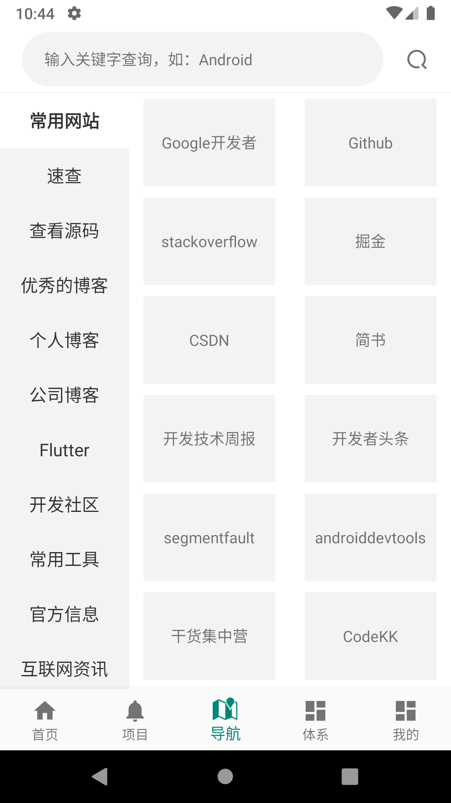
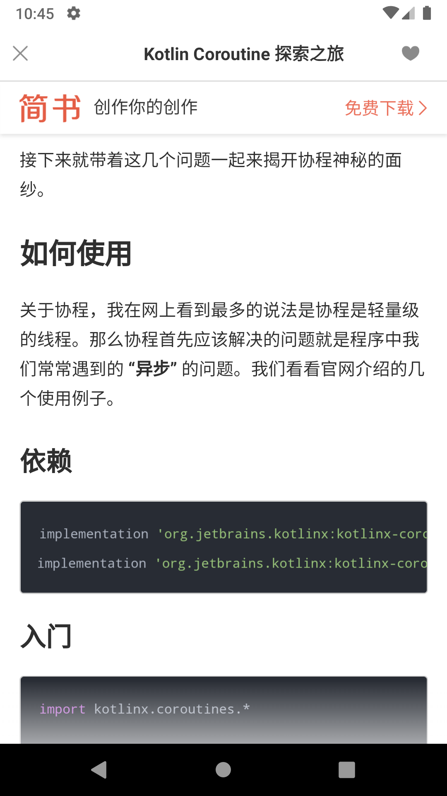
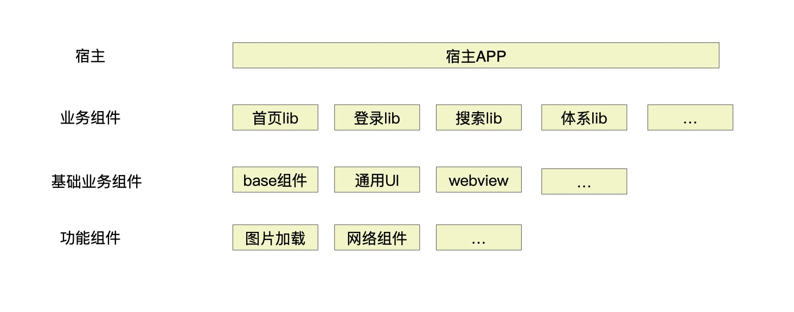
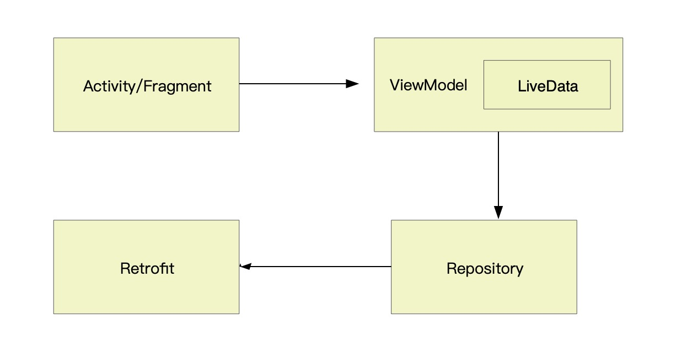

## 项目介绍

本项目采用组件化+MVVM架构进行开发，对功能组件和业务组件进行拆分，通过ARouter进行组件之间的通信。本文主要是对整个应用的技术架构作一个简单的介绍。

## 项目截图

 | | 
:-------------------------:|:-------------------------:|:-------------------------:
 | | 

## 技术要点

####  Kotlin+Jetpack+Coroutines+Retrofit+koin

项目整体架构图：



宿主App没有任何的业务代码，整个业务被拆分为各个ft_lib模块。对一些功能组件进行封装抽取为lib，提供给上层依赖。ft_lib之间没有任务依赖关系，通过Arouter进行通信。

## 首页功能
首页分为5个Tab，主要为首页、项目、导航、体系和我的。

整个页面框架使用BottomNavigationView + Navigation来搭建。通过menu来配置底部菜单。
通过NavHostFragment来配置各个fragment。系统提供的FragmentNavigator的navigate方法中是通过replace来加载fragment。
这就导致在切换Tab的时候fargment会重复的调用onCreateView方法。这肯定不是我们需要的。那么我们需要自定义自己的FragmentNavigator来替换系统
的，通过show和hide的方式来加载fragment。具体方式会在后续系列文章中进行讲解。

因为App使用了沉浸式状态栏，那么在使用的过程中也会出现只有第一个fragment的沉浸式是起作用的，其他的基本不生效。这个问题要从系统源码着手解决。
根本原因是这段代码：

```
private WindowInsets brokenDispatchApplyWindowInsets(WindowInsets insets) {
        if (!insets.isConsumed()) {
            final int count = getChildCount();
            for (int i = 0; i < count; i++) {
                insets = getChildAt(i).dispatchApplyWindowInsets(insets);
                if (insets.isConsumed()) {
                    break;
                }
            }
        }
        return insets;
    }
```
直接break了。所以我们也需要自定义一个view来重写dispatchApplyWindowInsets方法。具体也会在后续文章中进行讲解。


下面就简单介绍下各个Tab的技术要点。

#### 首页
首页主要分为顶部Banner和底部的文章列表。列表使用Paging加载。
并且封装了AbsListFragment和AbsListViewModel来快速搭建列表页面。
AbsListFragment主要是封装了页面布局相关的元素。
AbsListViewModel主要是封装了paging的一些常用配置等信息。
通过上述两个封装我们在开发列表页面的时候只需要关系DataSource和adapter即可。

#### 项目
项目Tab主要使用的是TabLayout和ViewPager2来配合实现联动。同样的ViewPager2的页面也是直接继承了AbsListFragment
来实现列表页面。

#### 导航
导航页面主要分为顶部的搜索和底部的分类。点击搜索后打开新的页面。通过fragment来承载热门搜索和搜索返回结果。
底部的分类主要是通过RecyclerView+ViewPager2来实现的。通过设置ViewPager2的orientation为ORIENTATION_VERTICAL来实现列表滑动。
同时实现了左侧RecyclerView 会随着右侧列表的滑动而滑动，这样保证了左侧选中的tab永远是可见的。

#### 体系
通过自定义FlowLayout来实现Tag标签管理。并进一步封装TagFlowLayout并对外提供TagAdapter来加载数据。


所有的下拉刷新换个下拉加载都是通过SmartRefreshLayout来实现的。通过阅读Paging源码我们了解到当请求数据返回空数据的时候，那么Paging就
不会继续帮我们来做分页加载了，默认会认为数据已经加载结束了。这个逻辑在实际开发中是有些问题的。所以就需要我们来返回空数据的时候手动来加载
分页逻辑。这里是通过自定义DataSource来完成。其实Paging框架只提供了加载数据的方式，在增加或者删除的逻辑目前都是不不支持的。这些都可以通过自定义
DataSource来完成。具体也会在后续文章中进行讲解。


## 网络请求
主要还是通过Retrofit+协程来完成。整个应用的数据流向架构为：




目前还未加缓存功能，后续会通过room来实现缓存功能。


## 组件通信

组件通信主要是通过Arouter来实现的。通过提供的IProvider来定义Service来完成。Service的实现定义在各自的module中。
并在base模块中定义ServiceImpl的包装类共调用方调用，这样对方就无需关心业务逻辑，直接使用即可。

## 依赖注入
因为App是采用Kotlin来开发的，所以 没有选择dagger2而是选择了Koin，适用于 Kotlin 开发人员的实用轻量级依赖注入框架。
用纯 Kotlin 编写，无代理，无代码生成，无反射。

学习地址 ：https://start.insert-koin.io/#/quickstart/kotlin

以上就是整个App功能的简单介绍，后续会单独讲解一些技术要点。
++++++++++++++++++

最后要感谢WanAndroid提供的开放API以及
https://github.com/lulululbj/wanandroid 项目提供的一些思路。

#### 扫描下方二维码关注公众号，获取更多技术干货。


 | |
:-------------------------:|:-------------------------:|
 | | 